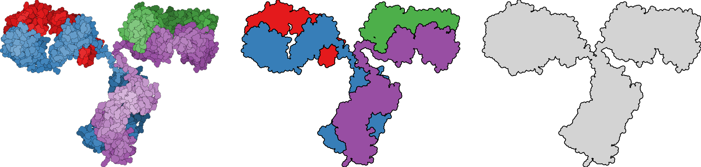

# Tools for proteome visualization
## pdb2svg: Vector outlines of macromolecular structure


### Installation
To run CellScape you will need:
* Python 3
* [PyMOL](https://pymol.org/2/) (optional)

CellScape and its dependencies can be installed with:

```
git clone https://github.com/jordisr/cellscape
cd cellscape
pip install -r requirements.txt
pip install -e .
```

### Example: Immunogolobulin
We can download an immunoglobulin structure from the PDB to test on:
```
curl -O https://files.rcsb.org/view/1IGT.pdb
```
#### Selecting the camera view in PyMOL
First open the protein structure in PyMOL, choose the desired rotation (zoom is irrelevant), and enter `get_view` in the PyMOL console. The output should look something like this:
```
### cut below here and paste into script ###
set_view (\
    -0.273240060,   -0.516133010,    0.811750829,\
     0.870557129,    0.226309016,    0.436930388,\
    -0.409222305,    0.826064587,    0.387488008,\
     0.000000000,    0.000000000, -544.673034668,\
    -0.071666718,  -17.390396118,    8.293336868,\
   455.182373047,  634.163574219,  -20.000000000 )
### cut above here and paste into script ###
```
Copy and paste the indicated region into a new text file, `view.txt`. In the absence of this rotation matrix, the program will attempt to align the view along the N-C axis of the protein. While this works acceptably for long, linear proteins (e.g. CEACAM5) for this example we'll want to specify the view beforehand.

#### Generating graphics from the command-line
The following examples should yield the three images used in the top figure (from left to right):
```
cellscape cartoon --pdb 1IGT.pdb --view view.txt --outline residue --color_by chain
```
The most realistic visualization projects the 3D coordinates down to two dimensions, and outlines each residue separately. Shading is used to simulate depth in a style inspired by [David Goodsell](https://pdb101.rcsb.org/motm/21).

```
cellscape cartoon --pdb 1IGT.pdb --view view.txt --outline chain --occlude
```
Each chain is outlined separately. The `--occlude` flag ensures that if the chains overlap, only the portion that is visible (i.e. closer to the camera) is incorporated into the outline.

```
cellscape cartoon --pdb 1IGT.pdb --view view.txt --outline all
```
A simple space-filling outline of the entire structure.

Full description of all options is available by running `cellscape cartoon -h`.
